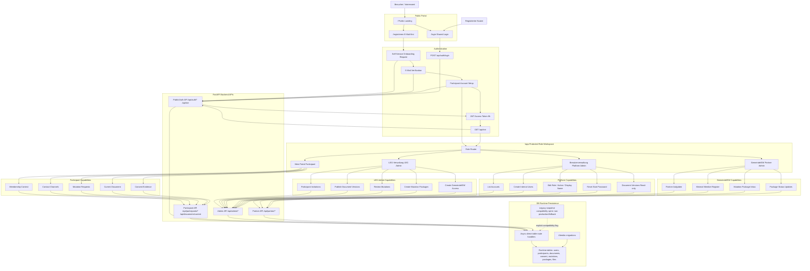

# SunTerra LEG Portal Mermaid Map

```mermaid
flowchart TB
  visitor["Besucher / Interessent"]
  registered["Registrierter Nutzer"]

  subgraph public["Public Portal"]
    landing["/ Public Landing"]
    register["/registrieren E-Mail-first"]
    login["/login Shared Login"]
  end

  subgraph auth["Authentication"]
    onboarding["Self-Service Onboarding Request"]
    emailVerify["E-Mail Verification"]
    accountSetup["Participant Account Setup"]
    loginApi["POST /api/auth/login"]
    meApi["GET /api/me"]
    jwt["JWT Access Token 8h"]
  end

  subgraph app["/app Protected Role Workspace"]
    router["Role Router"]

    participant["Mein Portal Participant"]
    legAdmin["LEG-Verwaltung LEG Admin"]
    partnerAdmin["Gemeinde/EW Partner Admin"]
    platformAdmin["Benutzerverwaltung Platform Admin"]
  end

  subgraph participantTools["Participant Capabilities"]
    membership["Membership Context"]
    currentDoc["Current Document"]
    consent["Consent Evidence"]
    contacts["Contact Channels"]
    mutationRequest["Mutation Requests"]
  end

  subgraph legTools["LEG Admin Capabilities"]
    invitations["Participant Invitations"]
    docPublish["Publish Document Versions"]
    review["Review Mutations"]
    packages["Create Mutation Packages"]
    partnerAccess["Create Gemeinde/EW Access"]
  end

  subgraph partnerTools["Gemeinde/EW Capabilities"]
    partnerTasks["Partner-Aufgaben"]
    memberRegister["Minimal Member Register"]
    packageInbox["Mutation Package Inbox"]
    packageStatus["Package Status Updates"]
  end

  subgraph platformTools["Platform Capabilities"]
    userList["List Accounts"]
    userCreate["Create Internal Users"]
    userEdit["Edit Role / Active / Display Name"]
    passwordReset["Reset Start Password"]
    docReadOnly["Document Versions Read-only"]
  end

  subgraph api["FastAPI Backend APIs"]
    publicAuthApi["Public/Auth API /api/auth/* /api/me"]
    participantApi["Participant API /api/participants/* /api/documents/current"]
    adminApi["Admin API /api/admin/*"]
    partnerApi["Partner API /api/partner/*"]
  end

  subgraph persistence["DB Runtime Persistence"]
    migrations["Alembic migrations"]
    runtimePersistence["Async direct-table route handlers"]
    coreTables["Runtime tables: users, participants, documents, consent, mutations, packages, files"]
    legacySnapshot["Legacy snapshot compatibility opt-in non-production/fallback"]
  end

  visitor --> landing
  landing --> register
  landing --> login
  registered --> login

  register --> onboarding
  onboarding --> publicAuthApi
  onboarding --> emailVerify
  emailVerify --> publicAuthApi
  emailVerify --> accountSetup
  accountSetup --> publicAuthApi
  accountSetup --> jwt
  accountSetup --> router

  login --> loginApi
  loginApi --> publicAuthApi
  publicAuthApi --> jwt
  jwt --> meApi
  meApi --> publicAuthApi
  meApi --> router

  router --> participant
  router --> legAdmin
  router --> partnerAdmin
  router --> platformAdmin

  participant --> membership
  participant --> currentDoc
  participant --> consent
  participant --> contacts
  participant --> mutationRequest

  legAdmin --> invitations
  legAdmin --> docPublish
  legAdmin --> review
  legAdmin --> packages
  legAdmin --> partnerAccess

  partnerAdmin --> partnerTasks
  partnerAdmin --> memberRegister
  partnerAdmin --> packageInbox
  partnerAdmin --> packageStatus

  platformAdmin --> userList
  platformAdmin --> userCreate
  platformAdmin --> userEdit
  platformAdmin --> passwordReset
  platformAdmin --> docReadOnly

  membership --> participantApi
  contacts --> participantApi
  mutationRequest --> participantApi
  currentDoc --> participantApi
  consent --> participantApi
  invitations --> adminApi
  docPublish --> adminApi
  review --> adminApi
  packages --> adminApi
  partnerAccess --> adminApi
  partnerTasks --> partnerApi
  memberRegister --> partnerApi
  packageInbox --> partnerApi
  packageStatus --> partnerApi
  userList --> adminApi
  userCreate --> adminApi
  userEdit --> adminApi
  passwordReset --> adminApi
  docReadOnly --> adminApi

  publicAuthApi --> runtimePersistence
  participantApi --> runtimePersistence
  adminApi --> runtimePersistence
  partnerApi --> runtimePersistence
  runtimePersistence --> coreTables
  migrations --> coreTables
  legacySnapshot -. explicit compatibility flag .-> runtimePersistence
```
